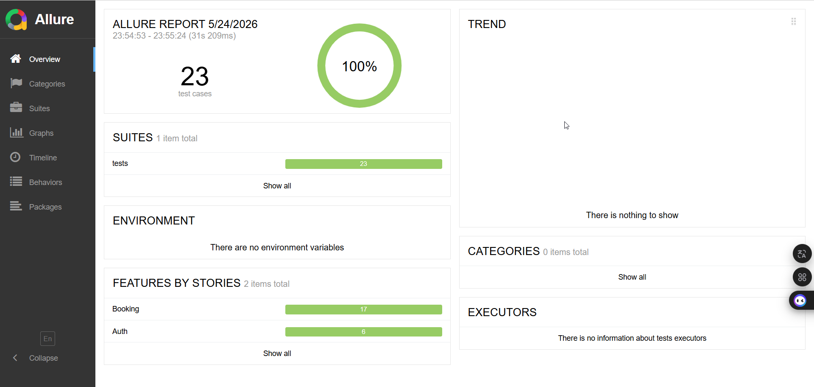

# Restful Booker API Test Suite

Автотесты для REST API сервиса бронирования отелей.

## 📋 Что тестирует проект

- **Health check** – `GET /ping` (доступность сервиса)
- **Аутентификация** – получение токена (`POST /auth`)
- **CRUD для бронирований**:
  - `POST /booking` – создание
  - `GET /booking/{id}` – получение
  - `PUT /booking/{id}` – полное обновление
  - `PATCH /booking/{id}` – частичное обновление
  - `DELETE /booking/{id}` – удаление
- **Валидация JSON Schema** ответов
- **Негативные сценарии** (некорректные данные, отсутствие авторизации)

## 🛠 Технологии

- **Python** 3.10+
- **Pytest** – фреймворк для тестирования
- **Requests** – HTTP-клиент
- **Allure** – генерация отчётов
- **Docker** + **Docker Compose** – контейнеризация
- **GitHub Actions** – CI/CD
- **GitHub Pages** – публикация отчётов

## 🚀 Установка и запуск

### 1. Клонировать репозиторий

```bash
git clone https://github.com/your-username/restful-booker.git
cd restful-booker
```
### 2. Установить зависимости
```bash
pip install -r requirements.txt
```
### 3. Запуск тестов
```bash
# Все тесты
pytest -sv

# Только проверка доступности
pytest tests/test_ping.py

# Только тесты авторизации
pytest tests/test_auth.py

# Только тесты бронирований
pytest tests/test_booking.py
```
Если в config/environments.py определены разные окружения (dev/stage/prod), можно передать параметр:

```bash
pytest -sv --env=dev
pytest -sv --env=stage
```
### 5. Просмотр Allure‑отчёта
```bash
allure serve allure-results
```
# 🐳 Запуск в Docker
| Команда | Описание |
| :--- | :--- |
| `docker-compose up` | Собрать и запустить все API тесты |
| `docker-compose up --build` | Пересобрать образ (использовать при изменении кода или библиотек) |
| `docker-compose down` | Очистить контейнеры и временные сети |

Выборочный запуск
```bash
# Только тесты бронирований
docker-compose run restful-booker pytest tests/test_booking.py

# С определённым окружением
docker-compose run restful-booker pytest --env=stage
```
Результаты (логи, allure-results) сохраняются локально в одноимённой папке. После прогона в Docker:

```bash
allure serve allure-results
```
# 📊 Пример Allure‑отчёта




# CI/CD

Проект использует **GitHub Actions** для автоматического запуска тестов и публикации Allure‑отчёта на **GitHub Pages**.

### Триггер

Workflow запускается при создании Pull Request в ветку `main`.

### Что делает pipeline

| Джоба | Описание |
|-------|----------|
| `run-tests` | Запускает тесты через `docker compose up`, генерирует Allure‑отчёт и сохраняет его как артефакт сборки. |
| `prepare-pages` | Загружает артефакт с отчётом и подготавливает его для деплоя на GitHub Pages. |
| `deploy-to-pages` | Публикует отчёт на GitHub Pages и возвращает URL. |

### Как посмотреть отчёт

1. После завершения workflow перейдите в **Settings** → **Pages** вашего репозитория.
2. Там будет указана ссылка на опубликованный сайт (например, `https://<username>.github.io/<repo>/`).
3. Отчёт автоматически обновляется при каждом успешном запуске тестов.

### Настройка GitHub Pages (один раз)

Чтобы деплой работал, в настройках репозитория (`Settings` → `Pages`) выберите источник **"GitHub Actions"**. После первого запуска всё настроится автоматически.

# 📁 Структура проекта
```text
restful-booker/
├── allure-results/               # Результаты тестов (Allure)
├── config/
│   └── environments.py           # Окружения (dev/stage/prod)
├── services/
│   ├── base_api.py               # Базовый HTTP-клиент
│   └── restful_booker/
│       ├── auth/                 # Аутентификация
│       │   ├── auth.py
│       │   ├── create_token.py
│       │   └── models/           # Pydantic/схемы для auth
│       ├── booking/              # Бронирования
│       │   ├── models/           # Схемы бронирований
│       │   ├── booking.py
│       │   ├── create_booking.py
│       │   ├── data.py           # Тестовые данные
│       │   ├── delete_booking.py
│       │   ├── get_booking.py
│       │   └── update_booking.py
│       └── ping/                 # Health check
│           └── health_check.py
├── tests/
│   ├── conftest.py               # Фикстуры (клиент, токен)
│   ├── test_auth.py
│   ├── test_booking.py
│   └── test_ping.py
├── utils/
│   └── helper.py                 # Вспомогательные функции
├── .env                          # Переменные окружения (не в git)
├── .gitignore
├── docker-compose.yml
├── Dockerfile
├── pytest.ini
├── requirements.txt
└── README.md
```
📝 Примечания
Для PUT, PATCH, DELETE требуется авторизация. В conftest.py реализована фикстура, которая получает токен перед такими тестами.

Все модели данных (JSON Schema) лежат в папках models/ внутри соответствующих сервисов.

При добавлении нового окружения расширьте config/environments.py и передавайте --env при запуске.